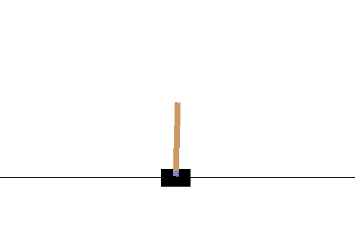
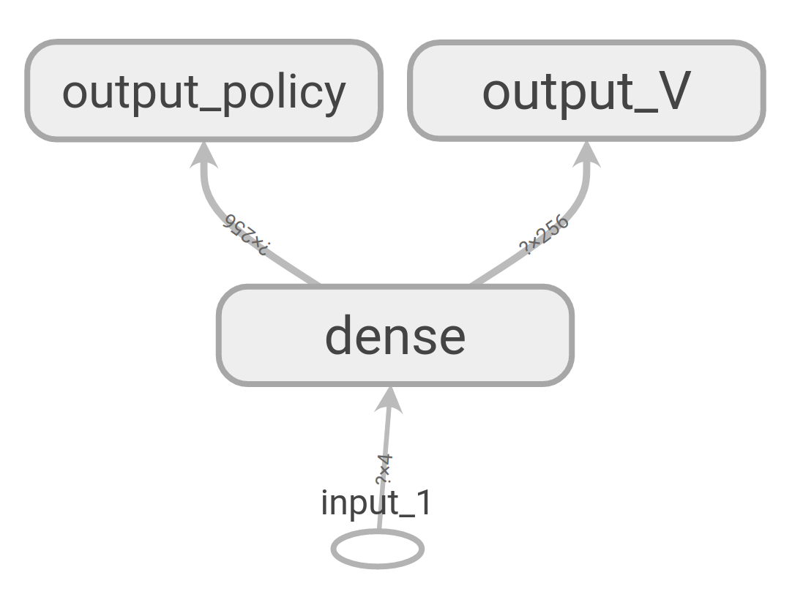
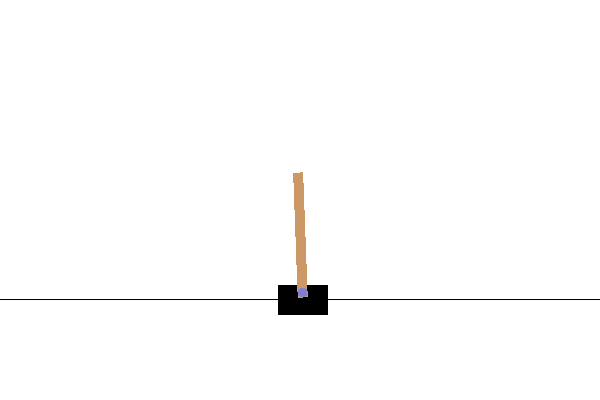
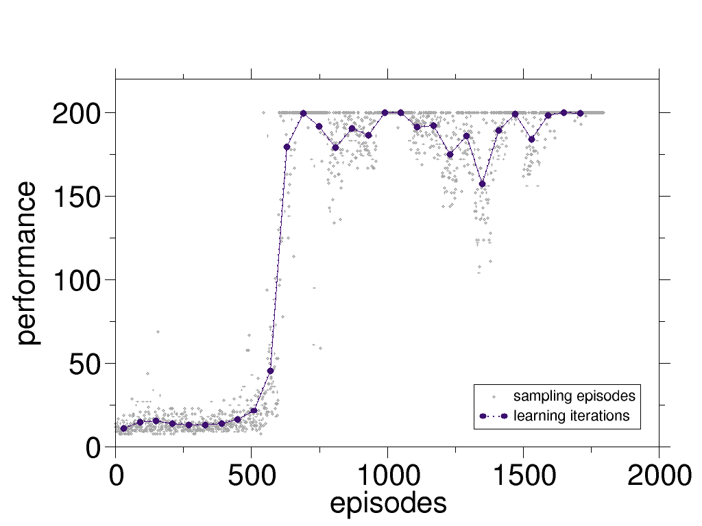
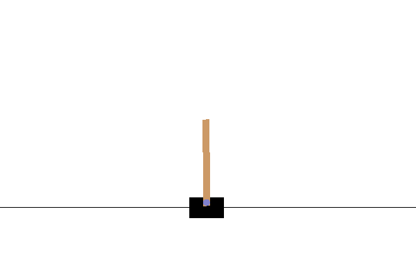
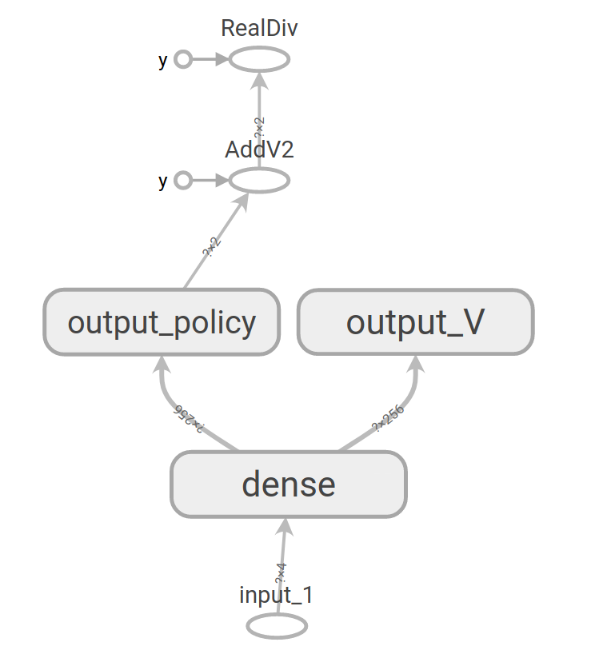
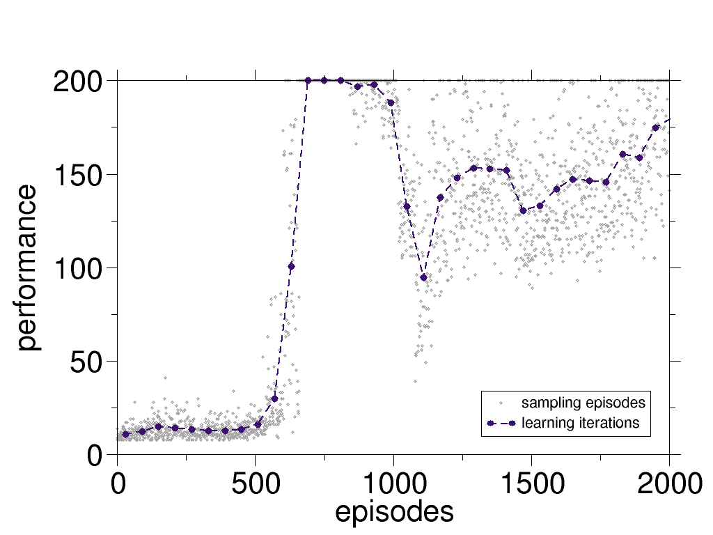

# cart-pole-deep-RL-actor-critic

## the problem

The problem is to train an agent which stabilizes a pole on a cart (an inverted pendulum problem). This is a classic problem in dynamics and control theory and is used as a benchmark for testing control strategies [[1]](https://en.wikipedia.org/wiki/Inverted_pendulum#:~:text=An%20inverted%20pendulum%20is%20a,additional%20help%20will%20fall%20over).

In the current presentation of the problem, the agent:
- observes the *current* position and velocity of the cart and the pole, 
- can only move the cart forward and backward for a fixed distance (+1/-1) every time. So the action space is discrete.


 
The environment is cart-pole-v1 env. from OpenAI Gym. A deterministic environment which rewards the agent by +1 every time step that it does not fail. The failing is defined as The agent fails when the angle between the pole and the vertical line exceeds a certain threshold. Here is an example of failure when the controller just moves the cart irrespective of the state of the pole.





## the approach

Here, the actor-critic method with deep neural networks (DNN) is used to stabilize the inverted pendulum.

Here, the DNN is designed such that policy and the value-function networks share some of the layers. This would allow faster training of the agents, presumably because the first layers of the DNNs extract features and map them to a more condensed representation space (a concept similar to transfer-learning). 



The main program is organized in the following way:
* **initialization**: random weights/biases are assigned to the network, 
* **experience loops**: 

  **(1)** a random initial state is assigned to the *state* variable,

  **(2)** given the *state*, an action (*a*) is chosen using the policy,

  **(3)** the action *a* is given to the environment, and the environment returns the new state, the reward, and a signal indicating the end of the episode.
  
  
  **(4)** if the process is not ended, the new state is assigned to the variable *state* and the execution continues to step **(2)** . 

All the states, actions, and the rewards are saved from the beginning of the episode until the end of it. This process is repeated for a number of episodes and all the data are gathered in an instance of the class *History*.

* **learning** : After sampling based on the policy, the obtained data is used to train the DNN. In the case of our DNN, defining the loss function is not straightforward. The reason behind this complication is the fact that this DNN has two types of outputs (classification for the action and regression for the value function) which are both affected by the weight and biases of the *same* shared layers. To train the weights/biases of these shared layers one should combine the binary cross entropy loss for the actions, and the mean squared error for the value function. One way to combine these different losses would be to consider a (weighted) average of them. Using this loss and the data gathered from the experience, we used the actor-critic algorithm to take a policy iteration step. Using this new policy, we go back to the **experience loops**.

## requirements
Besides the python3 and pip3

* gym 
* keras
* numpy
* os
* Pillow
* random
* tensorflow (version 2)

```
pip3 install -r requirements.txt
```
## usage

To execute the experiment loops and the learning one can run:
```
python3 experience-and-learn.py
```
This script runs experiments for a random policy and improves it. 

To use the simulator for sampling the not/trained agent, run

```
python3 simulator.py
```

To choose which agent is used one should change the file address of the model.

## results

Let's first start with a visual demonstration of an episode of a trained agent, as shown here. One can qualitatively see the improvement of the agent in stabilizing the pole.




One can quantify the *performance* of the agent simply as the duration of the time interval over which it holds the pole before failing. In the following figure, we showed the performance for each episode and also the averaged performance for each policy iteration step. In this case, the data from 60 episodes are used for each policy iteration step.



The maximum performance is limited to 200 steps as this is set by the cart-pole environment of OpenAI Gym as a limit.

## discussions

Using the actor-critic method, the agent can directly learn from their experience. As one can see in the above figure, after only ~10 policy iteration the agent figures out the right policy. One can stop the training at this point. Nevertheless, if one chooses to continue training, surprisingly the agent starts showing an unstable behavior, i.e. the performance oscillates. This is a known fact and in the following a few steps towards reduction of these oscillations are discussed. 

## experimenting with wind!

We also test the agent in presence of random perturbations. Here, we add "wind" which is blowing randomly and leads to a change the angle of the pole. An instance of such an experiment is presented here. One can observe that although the agent is trained in absence of the wind, it still performs reasonably well for in presence of the wind.



The windy experiments can be performed using ```simulator-windy.py```. The strength of the wind and its period can be changed by ```wind_power``` and ```wind_period``` variables in the script.

## tips and tricks

The aforementioned oscillations can be reduced significantly by introducing a small degree of exploration to the problem. One way to do so is using Boltzmann exploration (see [here](https://arxiv.org/abs/1705.10257) for details). A simpler approach which we considered here is similar to epsilon-greedy method:


 

where *output_policy* is the output of the DNN for the policy which has *nr_actions* elements (see the schematics of the DNN). This additional operation (with no learnable parameter) changes the design of the DNN as depicted below.




Of course, now one should choose a value for the epsilon in a proper range: on one hand, we observed that if the epsilon is too small, it does not have the desired stabilizing effect, and on the other hand, if it is too large, the overall performance of the agent is hindered. The value of epsilon is 0.001 for the results shown above. To observe the qualitative effect of introducing the epsilon, here the same performance curve is plotted for epsilon=0. One can see that the presence of the epsilon increases the overall performance of the agent and its learning process.




Detailed quantitative and analytical studies of the effect of epsilon is required.

## Future steps

* The sampling from each policy is a task which can be parallelized conveniently, as the episodes are independent of each other.
